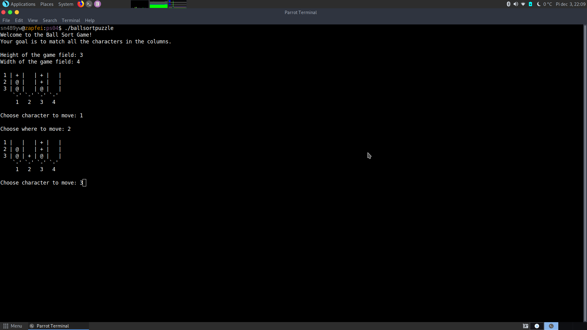

# Ball Sort Puzzle

Match all characters and symbols in collumns to win!

**ballsortpuzzle.c** - C file, contains source code

**ballsortpuzzle.h** - header file for all the functions

**main.c** - execution of functions in main()

**Makefile** - used to compile program

# How to use

Use *Makefile* to compile: ``make all``

Start with: ``./ballsortpuzzle``
