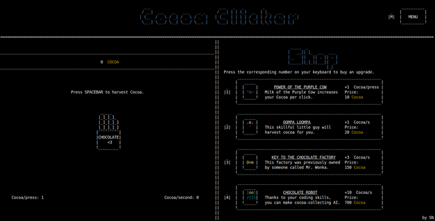

# Cocoa Clicker 🍫

Simple terminal game made with *nCurses* library in C. Inspired by *Cookie Clicker* 🍪.

Collect *Cocoa*, buy upgrades and enjoy 🍫.

# How to use

Available on Linux 🐧. You need to have *nCurses* library preinstalled.

Compile with: ``gcc -std=c11 program.c -lm -lcurses -o program``

Start with: ``./program``
