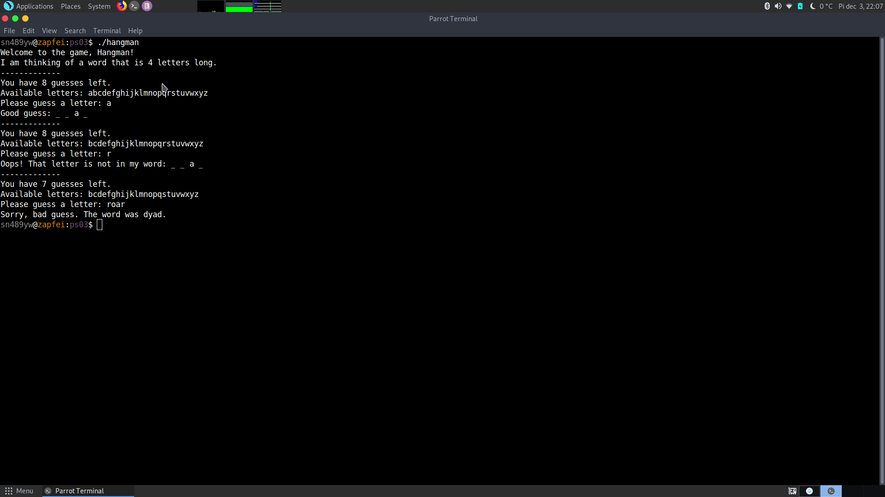

# Hangman Game 🎮

A simple terminal game. Guess a random word.

**hangman.c** - C file, contains source code

**hangman.h** - header file for all the functions

**main.c** - execution of functions in main()

**words.txt** - list of random common english words

**Makefile** - used to compile program

# How to use

Use *Makefile* to compile: ``make all``

Start with: ``./hangman``
