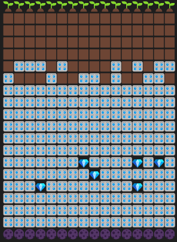

# Minecraft Generation Simulation 💻

This program simulates a simple Minecraft underground generation.
Randomly generates layers of dirt and diamonds 💎

Run with: ``go run main.go``

Build .exe: ``go build main.go``
