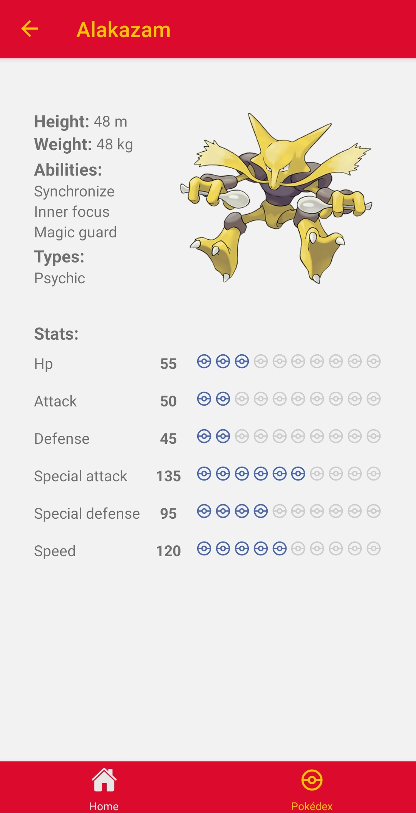

# Pokédex App ⚛

A simple Pokémon Database App made with *React Native* ⚛.

  
   

# How to use

Install all libraries in the folder: ``npm install``

Start *Metro*: ``npm run start``

Start App on *Android*: ``npm run android`` or iOS: ``npm run ios``
